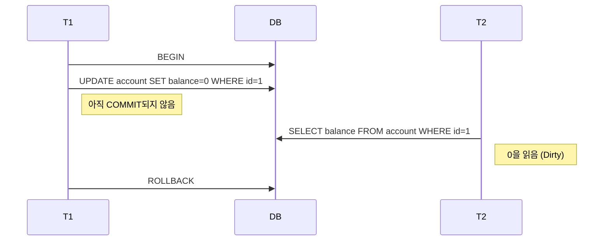
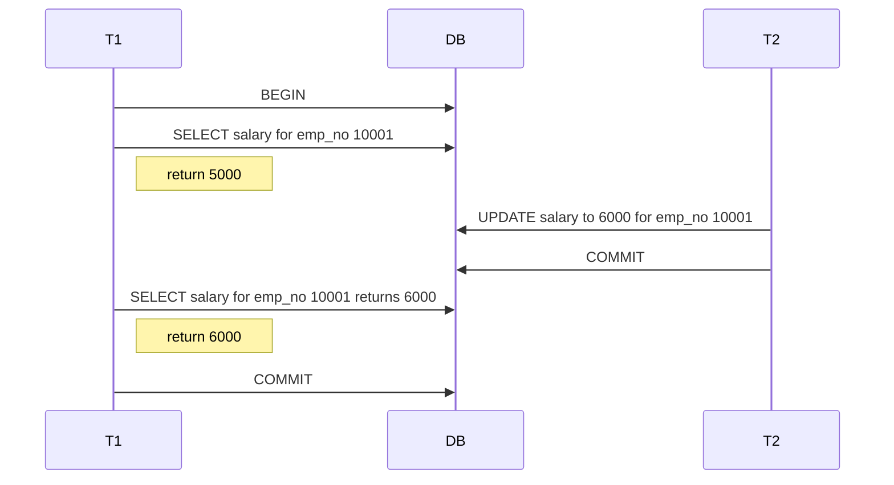
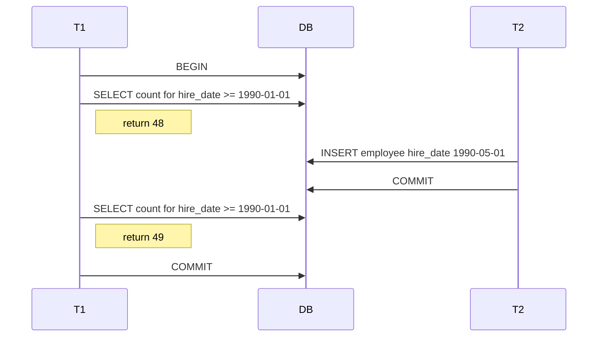

# 05. 트랜잭션과 잠금

---

## 5.1 트랜잭션

-   트랜잭션은 하나의 논리적 작업 단위를 모두 반영하거나 전혀 반영하지 않도록 보장한다.
-   잠금(lock)은 동시성 제어를 위한 메커니즘이고, 트랜잭션은 데이터 정합성 보장을 위한 메커니즘이다.

> **💡 핵심 포인트**
>
> -   트랜잭션은 Partial Update(부분 적용)를 방지한다.
> -   트랜잭션 범위는 “꼭 필요한 최소 구간”으로 한정해야 한다.

### 5.1.1 MySQL에서의 트랜잭션 (MyISAM vs InnoDB)

-   트랜잭션 미지원 엔진(MyISAM, MEMORY)에서는 오류 발생 시 부분 적용이 남을 수 있다.
-   InnoDB는 오류 발생 시 전체 작업을 원 상태로 복구한다.

```sql
-- MyISAM (Non-Transactional)
CREATE TABLE tab_myisam (
  fdpk INT NOT NULL,
  PRIMARY KEY (fdpk)
) ENGINE=MYISAM;

INSERT INTO tab_myisam (fdpk) VALUES (3);

-- InnoDB (Transactional)
CREATE TABLE tab_innodb (
  fdpk INT NOT NULL,
  PRIMARY KEY (fdpk)
) ENGINE=INNODB;

INSERT INTO tab_innodb (fdpk) VALUES (3);

-- AUTO-COMMIT 상태에서 중복 키 포함 INSERT를 실행
SET autocommit = ON;
INSERT INTO tab_myisam (fdpk) VALUES (1), (2), (3); -- 1,2는 반영되고 3에서 오류 → 부분 적용 발생
INSERT INTO tab_innodb (fdpk) VALUES (1), (2), (3); -- 오류 시 전체 롤백
```

```sql
-- InnoDB에서는 다음과 같이 명확하고 간결한 코드로 일관성을 보장할 수 있다
START TRANSACTION;
INSERT INTO tab_a ...;
INSERT INTO tab_b ...;
COMMIT;
-- 예외 시 ROLLBACK
```

### 5.1.2 트랜잭션 범위에 대한 주의사항

-   트랜잭션은 DB 작업이 시작되는 지점(예: INSERT/UPDATE/DELETE)부터 COMMIT/ROLLBACK까지로 최소화한다.
-   외부 I/O(메일 전송, FTP, 외부 API 통신 등)는 트랜잭션 바깥으로 분리한다.
-   하나의 요청 흐름에서 서로 다른 성격의 작업은 가능한 별도 트랜잭션으로 분리한다.

> **✅ 권장 사항 체크리스트**
>
> -   DB 커넥션 획득과 트랜잭션 시작을 가능한 늦춘다.
> -   네트워크 호출/파일 I/O는 트랜잭션 외부에서 처리한다.
> -   단순 조회는 트랜잭션에 포함하지 않는다.

---

## 5.2 MYSQL 엔진의 잠금

### 5.2.1 글로벌 락 (Global Lock)

-   `FLUSH TABLES WITH READ LOCK` 명령으로 획득하며, 서버 전역에 영향을 미치는 가장 범위가 큰 락이다.
-   SELECT를 제외한 대부분의 DDL/DML이 대기한다. 온라인 서비스에서는 사용을 지양한다.

```sql
FLUSH TABLES WITH READ LOCK;
-- 일관된 백업 등 특수 목적 수행
UNLOCK TABLES;
```

#### 백업 락 (MySQL 8.0+)

-   장시간 백업 시 안정성 확보를 위해 도입된 가벼운 전역 락.
-   스키마 변경, 사용자 변경 등은 차단하되 데이터 변경은 허용한다.

```sql
LOCK INSTANCE FOR BACKUP;
-- 안전한 백업 수행
UNLOCK INSTANCE;
```

> **⚠️ 주의**: 백업 도중 DDL을 막아 백업 실패를 예방하지만, 복제 지연/중지 전략과의 상호작용을 고려해야 한다.

### 5.2.2 테이블 락 (Table Lock)

-   명시적: `LOCK TABLES ... READ|WRITE` 로 특정 테이블에 락을 획득/해제.
-   묵시적: MyISAM/MEMORY 테이블의 DML 실행 시 자동으로 걸림. InnoDB는 대부분 무시되며 DDL에만 영향.

```sql
LOCK TABLES orders WRITE, order_items WRITE;
-- 작업 수행
UNLOCK TABLES;
```

### 5.2.3 네임드 락 (Named Lock)

-   임의의 문자열 키에 대해 획득/해제하는 애플리케이션 레벨 동기화 락.
-   복잡한 배치/동시 변경 구간의 단순 동기화에 유용.
-   분산락

```sql
SELECT GET_LOCK('mylock', 2);           -- 2초 대기 후 실패
SELECT IS_FREE_LOCK('mylock');           -- 1/0/NULL
SELECT RELEASE_LOCK('mylock');
SELECT RELEASE_ALL_LOCKS();              -- 8.0+: 보유 중인 네임드 락 일괄 해제
```

### 5.2.4 메타데이터 락 (Metadata Lock)

-   테이블/뷰 등의 이름·구조 변경 시 자동 획득되는 락.
-   `RENAME TABLE`을 단일 명령으로 묶어 일관성을 보장할 수 있다.

```sql
-- 안전: 두 개의 RENAME를 한 번에 수행 (원자적 교체)
RENAME TABLE rank TO rank_backup, rank_new TO rank;

-- 비권장: 분리 수행 시 짧은 순간 테이블 부재로 오류 가능
RENAME TABLE rank TO rank_backup;
RENAME TABLE rank_new TO rank;
```

---

## 5.3 InnoDB 스토리지 엔진 잠금

-   InnoDB는 레코드 기반 잠금을 제공하며, 락 에스컬레이션(레코드→페이지→테이블)이 없다.
-   잠금의 단위는 “레코드 자체”가 아니라 “인덱스 레코드”이다.

### 5.3.1 InnoDB 잠금 유형

#### 5.3.1.1 레코드 락 (Record Lock)

-   특정 인덱스 레코드 한 건에 대한 잠금.
-   PK/UNIQUE 조건의 변경에는 갭을 잠그지 않고 대상 레코드만 잠그는 경향이 있다.

#### 5.3.1.2 갭 락 (Gap Lock)

-   레코드와 레코드 사이의 “간격”에 대해 잠금.
-   해당 간격에 새로운 레코드가 INSERT 되는 것을 제어한다.

#### 5.3.1.3 넥스트 키 락 (Next-Key Lock)

-   레코드 락 + 갭 락의 결합 형태.
-   REPEATABLE READ 격리수준과 STATEMENT 포맷 바이너리 로그에서 일관성 보장을 위해 널리 사용.
-   불필요한 교착/대기를 줄이려면 ROW 포맷 바이너리 로그 사용을 고려한다.

#### 5.3.1.4 자동 증가 락 (AUTO_INCREMENT Lock)

-   INSERT/REPLACE 시 자동 증가 값 할당을 위해 매우 짧게 걸리는 테이블 수준 락.
-   `innodb_autoinc_lock_mode`로 동작 모드를 조절한다.

| 모드 | 설명                                                                         |
| ---- | ---------------------------------------------------------------------------- |
| 0    | 모든 INSERT에 자동 증가 락 사용 (구버전 방식)                                |
| 1    | 예측 가능한 INSERT는 경량 래치 사용, 대량 INSERT 등은 락 사용 (연속 값 보장) |
| 2    | 항상 경량 래치 사용, 동시성 최고 (값의 연속성은 보장하지 않음)               |

> **⚠️ 주의**:MySQL 8.0 기본값은 `2`이며, ROW 포맷 바이너리 로그와의 궁합이 좋다. STATEMENT 포맷 사용 시 주의.

### 5.3.2 인덱스와 잠금의 관계

-   InnoDB는 “변경을 위해 검색한 모든 인덱스 레코드”에 잠금을 건다.
-   부적절한 인덱스 설계는 잠금 범위를 급격히 확대하여 동시성을 저하시킨다.

```sql
-- employees(first_name) 인덱스만 있는 경우
-- 아래 UPDATE는 실제 1행만 변경되더라도 first_name='Georgi'인 인덱스 레코드(예: 253건)에 잠금을 건다
UPDATE employees
SET hire_date = NOW()
WHERE first_name = 'Georgi' AND last_name = 'Klassen';

-- 개선: (first_name, last_name) 복합 인덱스 설계로 잠금 범위 최소화
CREATE INDEX ix_first_last ON employees (first_name, last_name);
```

### 5.3.3 레코드 수준 잠금 모니터링과 해제

-   MySQL 8.0에서는 `performance_schema`의 `data_locks`, `data_lock_waits`로 잠금과 대기 관계를 확인한다.
-   장시간 대기/보유 세션은 `KILL <process_id>`로 강제 종료할 수 있다.

```sql
-- 현재 잠금과 잠금 대기 관계 확인 (요약 예시)
SELECT * FROM performance_schema.data_locks\G
SELECT * FROM performance_schema.data_lock_waits\G

-- 프로세스 목록과 상태 확인
SHOW PROCESSLIST;

-- 문제가 되는 세션 종료
KILL 12345;
```

---

## 5.4 MYSQL 격리수준

MySQL(InnoDB)의 기본 격리수준은 REPEATABLE READ이며, MVCC(멀티 버전 동시성 제어)와 넥스트 키 락으로 높은 일관성을 제공한다. 격리수준은 동시성과 일관성의 균형을 정한다.

| Isolation level        | Dirty read | Non-repeatable read | Phantom read |
| ---------------------- | ---------- | ------------------- | ------------ |
| READ UNCOMMITTED       | 허용       | 허용                | 허용         |
| READ COMMITTED         | 차단       | 허용                | 허용         |
| REPEATABLE READ (기본) | 차단       | 차단                | 차단(주)     |
| SERIALIZABLE           | 차단       | 차단                | 차단         |

> **⚠️ 주의**: InnoDB의 REPEATABLE READ는 MVCC 스냅샷 + 넥스트 키 락으로 전통 정의와 달리 팬텀을 실질적으로 차단한다. 단, 비잠금 읽기(Consistent Read)에서는 스냅샷 시점에 따라 차이가 나지 않도록 “트랜잭션 단위 스냅샷”을 유지한다.

### 격리수준 설정 (SET TRANSACTION ISOLATION LEVEL)

-   세션 전체에 적용: 이후 시작되는 모든 트랜잭션에 적용된다.

```sql
SET SESSION TRANSACTION ISOLATION LEVEL READ COMMITTED;
```

-   다음 1개 트랜잭션에만 적용: 반드시 트랜잭션 시작 전에 설정한다.

```sql
# sql
SET TRANSACTION ISOLATION LEVEL READ COMMITTED;
START TRANSACTION;
-- statements...
COMMIT;
```

```js
// typeorm
await dataSource.manager.transaction({ isolation: 'READ COMMITTED' }, async (manager) => {
	await manager.query('SELECT ...');
});
```

-   서버 기본값 변경: 신규 커넥션부터 적용(권한 필요). 영구 적용은 설정 파일에 반영.

```sql
SET GLOBAL transaction_isolation = 'READ-COMMITTED';
```

-   현재 격리수준 확인:

```sql
SELECT @@transaction_isolation; -- e.g., REPEATABLE-READ
```

---

### 5.4.1 READ UNCOMMITTED

-   커밋되지 않은 변경을 다른 트랜잭션이 읽을 수 있다
-   동시성은 높으나 데이터 일관성 문제가 크다
-   **Dirty Read 발생**



---

### 5.4.2 READ COMMITTED

-   항상 `커밋된 최신 데이터`를 읽는다
-   **Non-Repeatable Read 발생**



---

### 5.4.3 REPEATABLE READ

-   트랜잭션 첫 Consistent Read 시점의 스냅샷을 트랜잭션 종료까지 유지한다.
-   팬텀을 방지하려면 범위 잠금이 걸리는 Locking Read(FOR UPDATE/SHARE)를 사용한다.
-   **Phantom Read (없던 데이터가 생기는 현상) 발생**



---

### 5.4.4 SERIALIZABLE

-   가장 엄격한 격리수준. 읽기조차 사실상 직렬화되어 동시성이 크게 낮아진다.
-   SELECT가 암묵적으로 공유/범위 잠금을 획득할 수 있어 경합이 커진다. 꼭 필요한 경우에만 사용한다.

---

### 5.4.5 격리수준 선택 가이드

-   기본값(REPEATABLE READ): 일관성이 우선일 때, MySQL의 MVCC/넥스트 키 락이 팬텀을 방지해 예측 가능성이 높다.
-   READ COMMITTED: 동시성을 높이고 갭 락/교착을 줄이고 싶을 때 고려(일부 시스템/ORM에서 선호). 재조회 결과 변동 가능성에 대비 필요.
-   SERIALIZABLE: 강한 직렬화가 필요한 드문 케이스(동시성 감소, 주의).

> 대규모 동시 갱신/범위 검색 환경에서 잠금 경합이 크다면 READ COMMITTED로 전환해 보되, 정확성이 필요한 구간은 적절히 FOR UPDATE/SHARE로 보강한다.

---
