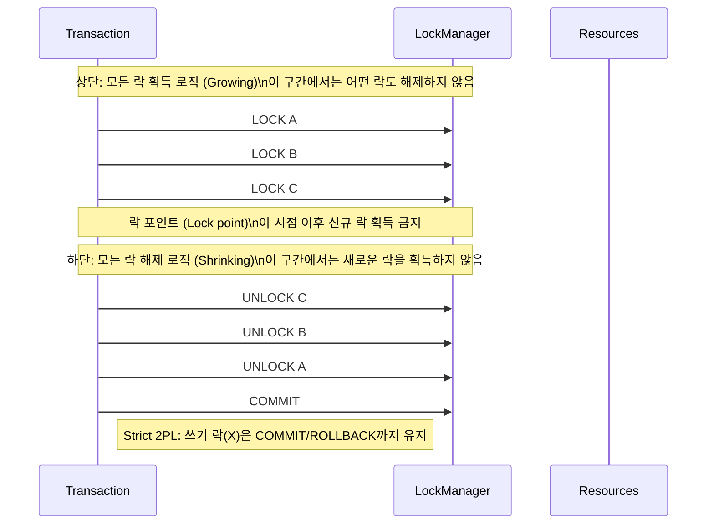
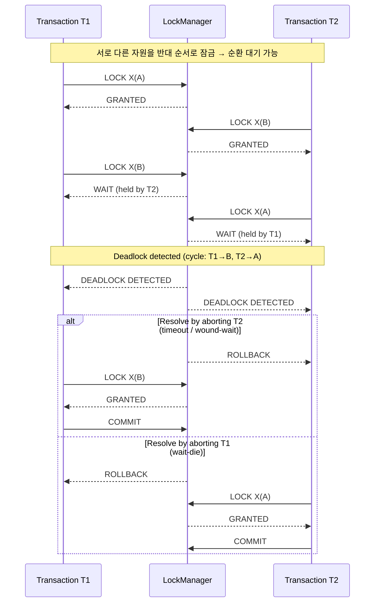

## 2PL (Two-Phase Locking)

-   트랜잭션이 락을 획득하는 구간과 해제하는 구간을 명확히 분리해 직렬가능성을 보장하는 동시성 제어 프로토콜.

-   **상단에 모든 락획득 로직을 추가**
-   **하단에 모든 락 해제 로직을 추가**

---

-   **장단점**:

    | 구분 | 내용                                                                              |
    | ---- | --------------------------------------------------------------------------------- |
    | 장점 | 직렬가능 스케줄 보장 데이터 일관성 강화                                       |
    | 단점 | 교착상태(Deadlock) 가능성 증가 운영 정책 필요: 타임아웃, Wait-Die, Wound-Wait |

-   **변형**

    -   Strict 2PL: 쓰기 락(X)을 커밋/롤백까지 유지 → 복구 용이(recoverable), 도중 읽기 일관성 향상
    -   Rigorous 2PL: 읽기/쓰기 락(S/X) 모두를 커밋/롤백까지 유지 → 가장 보수적, 직렬화가 가장 명확

-   **MySQL/InnoDB와의 관계**
    -   InnoDB는 Locking Read(FOR UPDATE/SHARE)와 갭/넥스트키 락을 통해 사실상 2PL에 가까운 동작으로 일관성을 보강함
    -   변경 레코드의 X 락을 커밋까지 유지(Strict 2PL 유사), 범위 질의에서는 넥스트키 락으로 팬텀 방지
    -   교착 최소화 팁: 짧은 트랜잭션, 일관된 접근 순서, 적절한 인덱스 설계, 필요한 경우 READ COMMITTED + 명시적 Locking Read 병행

---

### 2PL Deadlock 예시

#### Deadlock 해결 방법

-   일관된 락 획득 순서 유지 (예: 항상 A→B 순서)
-   트랜잭션 짧게 유지, 필요 최소 구간만 락 보유
-   타임아웃과 데드락 감지 활성화 후 자동 재시도
-   인덱스 설계 개선으로 락 범위 축소, 불필요한 범위 잠금 회피
